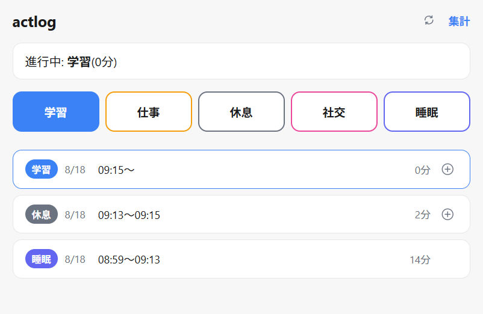

# actlog-demo

学習・仕事・休息・社交・睡眠の5カテゴリで、1日24時間を必ずどれかに割り当てて記録する個人用の活動記録アプリ。

**デモ**: https://actlog-demo.vercel.app



このデモ版には認証もバックエンドDBも無い。データはブラウザの`localStorage`にのみ保存され、サーバーには一切送信されない。1つの端末・1つのブラウザで使うことを前提にした構成。

## 主な機能

- **記録画面(`/`)**: カテゴリーボタンを押すと、進行中の活動を今の時刻で閉じ、同時刻から新しい活動を開始する。
- **活動一覧の編集**: 各活動のカテゴリー・開始時刻・概要(任意)を後から修正できる。編集は前後の活動の境界と連動し、隙間や重複が生まれないよう検証する。
- **活動の挿入・削除**: 隣接する2つの活動の間に新しい活動を挿入したり、既存の活動を削除して前後の活動に時間を引き継がせたりできる。
- **`#タグ`**: 概要欄に`#タグ名`と書くと集計画面でタグ別の合計時間が出る。
- **集計画面(`/dashboard`)**: 直近7日/30日の移動窓でカテゴリー別・タグ別の合計時間を棒グラフで表示。

## 技術スタック

- **フロントエンド**: React 19 + react-router 7(SPA)、Vite 7
- **データ層**: ブラウザの`localStorage`(`lib/api.ts`)。サーバー・DBは無い。
- **言語**: TypeScript(5系固定)
- **テスト**: Node.js組み込みテストランナー(`node --test --experimental-strip-types`)

## セットアップ

```bash
npm install
npm run dev        # vite単体で起動
npm run build       # 本番ビルド
npm run typecheck   # 型チェック
npm run test        # テスト実行
```

## ライセンス

MIT

## 設計思想

### データ層の境界

`lib/api.ts`が公開する`ActivityStore`インターフェース(`fetchActivities` / `startActivity` / `updateActivity` / `deleteActivity` / `insertActivity`)が、`hooks/useActivityLog.tsx`とデータ層の唯一の境界。バックエンドを差し替えたくなったら、この5関数を実装したモジュールで`lib/api.ts`を置き換えればよい(呼び出し側は無改修で済む)。

`lib/api.ts`内部では`readStore`/`writeStore`という非公開ヘルパー2つだけがストレージに直接触る。将来インメモリキャッシュ等を足したくなったら、この2関数の中身だけを差し替えれば済む構造にしてある。

検証ロジック(`validateStartTime`・`normalizeSummary`・`floorToMinute`等)は`lib/shared/`にDB非依存の純粋関数として置いてあり、バックエンドを差し替えてもそのまま再利用できる。

### データモデルの前提: 網羅性

`activities`は「1日24時間を必ず5カテゴリのいずれかに割り当てる」設計。**各活動は`start_time`だけを持ち、`end_time`は保存しない。** ある活動のend_timeは「時間的に次の活動のstart_time」として導出される値(`lib/shared/endTime.ts`の`deriveEndTimes`)で、最新の活動だけ導出結果が`null`(進行中)になる。活動は独立した「チェックインイベント」というのが設計の核心の考え方で、境界の同期(隙間なし)は保存の重複ではなく導出によって構造的に保証される。この前提を崩す変更(同時並行の活動を許すなど)は根本的な方針変更なので安易に行わない。

- 時刻は分単位(秒切り捨て、四捨五入しない)。
- 同じ分のうちに別カテゴリーを押すと`start_time`が衝突するため拒否される(補正しない)。
- 活動の「終了時刻を編集する」というUI操作は無い。境界を変えたいときは、次の活動のカードを開いてその「開始」を編集する。
- 削除は常に1行消すだけ(隣接行への書き込みなし)。空いた時間は直前の活動の記録に自動的に(導出end_timeとして)引き継がれる。
- 概要(summary)は任意項目。未入力は空文字、`null`は使わない。
- `#タグ`は概要内の書き方の約束(専用列なし)。

### 更新は楽観的(optimistic)

先にローカルstateを書き換えて描画し、そのあとデータ層への書き込みを行う(`hooks/useActivityLog.tsx`の`mutate()`)。localStorage版では書き込みはほぼ即時に完了するが、`mutate()`自体はデータ層の実体(localStorageかHTTP経由のAPIか)を知らないので無改修で動く。

- サーバー未確定の行は負のid。`isPending()`で判定し、負idにupdate/deleteを投げない。
- 入力欄は非制御(`defaultValue`)にする。制御コンポーネントにすると楽観的更新の再描画で入力中の値がstateの値に巻き戻る。

### 技術方針

- TypeScriptは5系固定。
- 依存を増やさない(`react` / `react-dom` / `react-router` + 開発用`vite`系のみ)。
- テストは`node --test --experimental-strip-types`(Vitest等は使わない)。
- クライアントルートを増やしたら`vercel.json`の`rewrites`にも1行足す。
